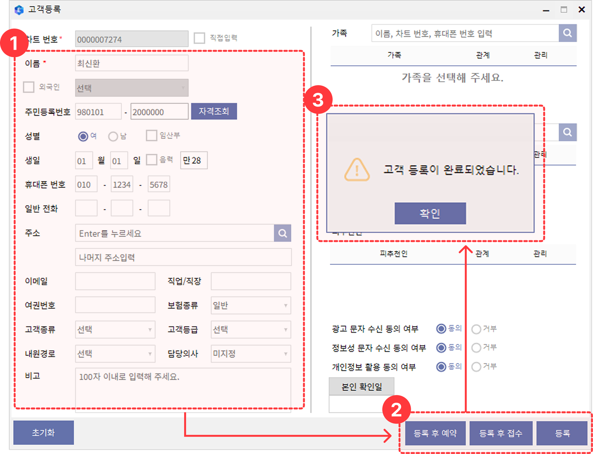

# FAQ 페이지 편집 가이드 (Claude 없이 직접 수정하기)

- **라이브 주소**: https://garamiaa.github.io/triup-motion-faq/
- **저장소(코드)**: https://github.com/garamiaa/triup-motion-faq
- **모든 내용이 들어있는 파일**: `index.html` (이 파일 하나만 고치면 됩니다)

> ⚠️ 중요: 이 페이지는 **Notion과 연결돼 있지 않습니다.** Notion을 수정해도 사이트는 바뀌지 않아요. 반드시 아래 방법으로 `index.html`을 직접 고쳐야 합니다.

---

## 방법 1. GitHub 웹에서 편집 (설치 필요 없음 · 가장 쉬움)

1. https://github.com/garamiaa/triup-motion-faq 접속 (garamiaa 계정 로그인)
2. `index.html` 파일 클릭
3. 오른쪽 위 **연필(✏️) 아이콘** 클릭 → 편집 모드
4. 내용 수정
5. 오른쪽 위 초록색 **Commit changes...** 버튼 클릭 → 다시 **Commit changes**
6. **1~2분 뒤** 라이브 사이트에 자동 반영 (확인할 땐 `Ctrl+F5`로 새로고침)

이미지 추가: `images` 폴더 클릭 → **Add file ▸ Upload files** 로 그림 업로드

---

## 방법 2. 내 컴퓨터에서 편집 후 올리기

파일 위치: `C:\project\n8n_example\index.html`
메모장·VS Code 등으로 열어 수정 후, PowerShell에서:

```
cd C:\project\n8n_example
git add -A
git commit -m "FAQ 내용 수정"
git push
```

---

## index.html 구조 이해하기

**질문 하나 = 두 부분**이 짝을 이룹니다. 두 부분은 `data-id` 숫자로 연결돼요. (예: `data-id="1"` 질문 ↔ `data-id="1"` 답변)

### ① 왼쪽 목록의 질문 — `<aside class="q-list">` 안에 있음
```html
<button class="q-item" data-id="1" data-cat="고객관리" data-search="검색용 텍스트">
  <span class="qi-cat">고객관리</span>
  <span class="qi-text">신환(고객)등록은 어떻게 하나요?</span>
  <svg class="qi-arrow" ...></svg>
</button>
```

### ② 오른쪽 답변 — `<section class="detail">` 안에 있음
```html
<div class="detail-panel" data-id="1">
  <div class="dp-cat">고객관리</div>
  <h2 class="dp-q">신환(고객)등록은 어떻게 하나요?</h2>
  <div class="dp-body">
    <p>여기에 답변 내용...</p>
    <figure></figure>
  </div>
</div>
```

---

## 자주 하는 작업

### ✏️ 기존 답변 내용 고치기
`<div class="detail-panel" data-id="N">` 를 찾아 그 안 `<div class="dp-body">` 의 글을 수정.
- 문단: `<p>내용</p>`
- 목록: `<ul><li>항목</li></ul>` (숫자 목록은 `<ol>`)
- 굵게: `<strong>강조할 말</strong>`

### ➕ 새 질문 추가하기
1. 기존 `<button class="q-item" ...>...</button>` 하나를 통째로 복사해 목록에 붙여넣기
2. 짝이 되는 `<div class="detail-panel" ...>...</div>` 하나도 복사해 답변 영역에 붙여넣기
3. 두 곳의 `data-id` 를 **아직 안 쓴 새 숫자(예: 19)** 로 똑같이 바꾸기
4. 질문 글, 답변 글, 카테고리 이름 수정

### 🗑️ 질문 삭제하기
해당 `data-id` 의 `q-item` 과 `detail-panel` **두 개 모두** 지우기

### 🖼️ 이미지 넣기
1. 그림을 `images` 폴더에 올리기 (예: `images/new.png`)
2. 답변 안에 추가: `<figure></figure>`

### 🏷️ 카테고리
사용 가능: `고객관리` `차트` `매출관리` `관리자` `수납` `설정`
(상단 탭에 있는 이름만 필터됩니다. 새 카테고리를 쓰려면 상단 `<div class="tabs">` 의 탭 버튼도 추가해야 해요.)

---

## 팁
- 고치기 전 겁나면, GitHub에서 파일 우측 **History**로 언제든 이전 버전으로 되돌릴 수 있어요.
- `<` `>` `&` 같은 기호를 글자로 넣을 땐 각각 `&lt;` `&gt;` `&amp;` 로 써야 안전합니다.
- 큰 변경(디자인·구조)이나 Notion 내용 전체 다시 가져오기는 Claude에게 부탁하는 게 편해요.
